# Spherical Image Generation from a Single Image by Considering Scene Symmetry

This repository implements the training, testing and evaluation tools for "Spherical Image Generation from a Single Image by Considering Scene Symmetry". 

This program generates a spherical image from a single normal-field-of-view (NFOV) image taken using a normal
camera. The proposed method can generate various plausible spherical images controlled from symmetric to asymmetric, and can reduce the reconstruction errors of the generated images based on the estimated symmetry.

## Example results

 Examples of the generated results for images in the [SUN 360 dataset](http://people.csail.mit.edu/jxiao/SUN360/main.html) are shown below. An image of the entire field of view is generated from the mask image in equirectangular projection (ERP) format corresponding to the NFOV image.

<table>

<tr>
<td>NFOV Image</td>
<td>Masked Image in ERP</td>
<td>Generated Image</td>
<td>Grournd Truth</td>

</tr>

<tr>
<td>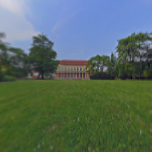</td>
<td>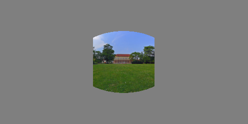</td>
<td>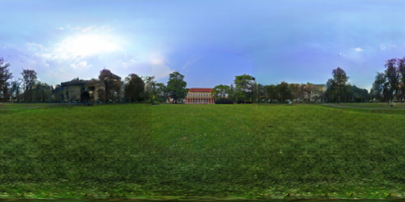</td>
<td>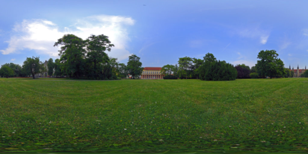</td>
</tr>

<tr>
<td>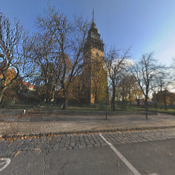</td>
<td>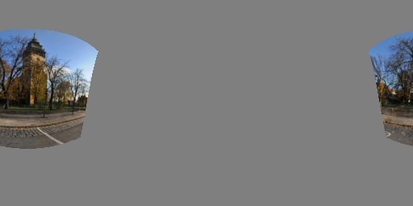</td>
<td>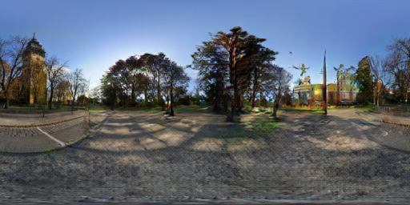</td>
<td>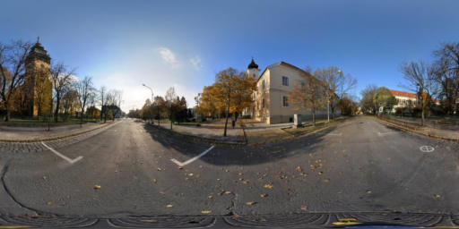</td>
</tr>

<tr>
<td>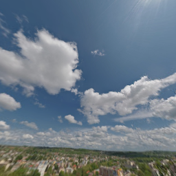</td>
<td>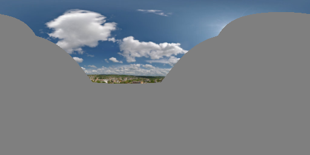</td>
<td>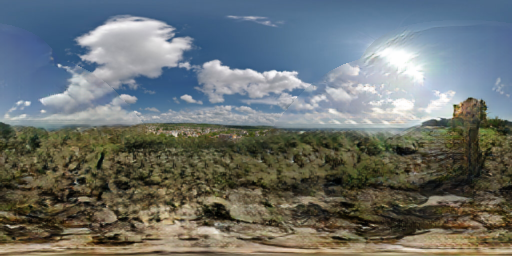</td>
<td>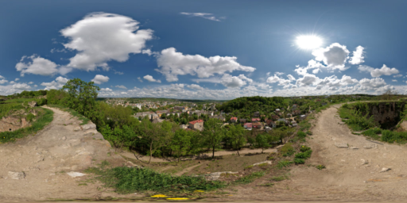</td>
</tr>

</table>

## Installation
This code was tested with Pytoch 1.6.0, CUDA 11.0, Python 3.8.8 and Ubuntu 20.04.2 LTS

- Install Pytoch 1.6.0, torchvision, and other dependencies from [http://pytorch.org](http://pytorch.org)
- Install python libraries [visdom](https://github.com/facebookresearch/visdom), [dominate](https://github.com/Knio/dominate), opencv-python, imageio

```sh
pip install visdom dominate opencv-python imageio
```
- Clone this repo:

```sh
git clone https://github.com/hara012/sig-ss
cd sig-ss
```

## Pretrained models

You can download the pre-trained models from [this link](https://drive.google.com/file/d/1esthIvR7ZA2J68Xi5MgujE7WvRRG3zMr/view?usp=share_link). Then, unzip the downloaded file and place `*.pth` in `checkpoints/default` directory. These models are trained using 50,000 training images from [SUN 360 dataset](http://people.csail.mit.edu/jxiao/SUN360/main.html).

## Testing

You can generate spherical images from masked images described in the image list by executing in the following format.

```sh
python test.py  --name [expermental name] --img_file [image list path] --gpu_ids [gpu id]
```

When using cpu, set `-1` to the `gpu_ids` option. 
If you placed the above pre-trained models in the default directory, run the following command.

```sh
python test.py  --name default --img_file list_imgs/list_test.txt --gpu_ids 0
```

- The default results will be saved under the *results* folder. Set ```--results_dir``` for a new path to save the result.
- The more testing options can be found in `options` directory.

## Training

You can train the network by executing in the following format.

```sh
python train.py --name [expermental name] --img_file [image list path] --gpu_ids [gpu id]
```

- To view training results and loss plots, run ```python -m visdom.server``` and copy the URL [http://localhost:8097](http://localhost:8097).
- Training models will be saved under the `checkpoints` directory.
- The more training options can be found in `options` directory.

## Use other masks

You can generate masks for various positions and fields of view as follows:

```sh
python util/genMask.py -n [number of mask] -o [out dir]
```

For example, to generate 10 masks, run the following:

```sh
python util/genMask.py -n 10 -o mask/rand10
```

When testing and training, specify the mask directory with the `--mask_dir` option.  
For example, run the following:

```sh
python test.py  --name default --img_file list_imgs/list_test.txt --mask_dir mask/rand10
```

## License
<br />This work is licensed under a <a rel="license" href="http://creativecommons.org/licenses/by-nc/4.0/">Creative Commons Attribution-NonCommercial 4.0 International License</a>.

This software is for educational and academic research purpose only. If you wish to obtain a commercial royalty bearing license to this software, please contact us at hara@mi.t.u-tokyo.ac.jp.

## Citation

If you use this code for your research, please cite our paper.

[AAAI 2021](https://ojs.aaai.org/index.php/AAAI/article/view/16242)
```
@inproceedings{hara2021sig-ss,
  title={Spherical Image Generation from a Single Image by Considering Scene Symmetry},
  author={Takayuki Hara and Yusuke Mukuta and Tatsuya Harada},
  booktitle={Proc. AAAI Conf. Artif. Intell.},
  pages={1513-1521},
  year={2021}
}
```

[TPAMI](https://doi.org/10.1109/TPAMI.2022.3215933)
```
@article{hara2022sig-ss,
    author  = {Takayuki Hara and Yusuke Mukuta and Tatsuya Harada},
    journal = {IEEE Transactions on Pattern Analysis and Machine Intelligence},
    title   = {Spherical Image Generation From a Few Normal-Field-of-View Images by Considering Scene Symmetry},
    year    = {2022},
    pages   = {1-15},
    doi     = {10.1109/TPAMI.2022.3215933},
}
```

## References
This source code was created by modifying the following code:

Pluralistic Image Completion: [https://github.com/lyndonzheng/Pluralistic-Inpainting](https://github.com/lyndonzheng/Pluralistic-Inpainting)

Zheng, Chuanxia and Cham, Tat-Jen and Cai, Jianfei, "Pluralistic Image Completion," Proceedings of the IEEE Conference on Computer Vision and Pattern Recognition, pp.1438-1447, 2019.

